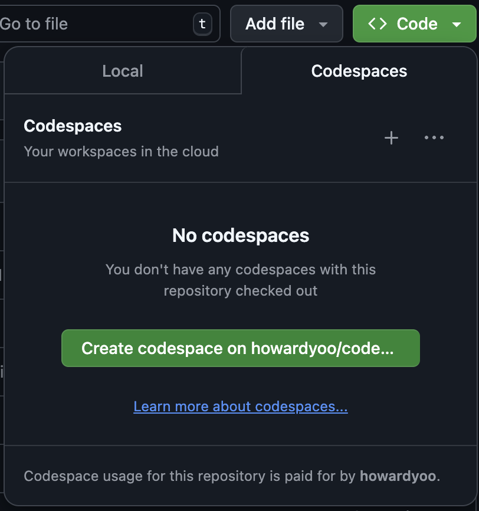

# Honeycomb Advanced Instrumentation Workshop

Exercises to help you learn advanced instrumentation techniques with OpenTelemetry and Honeycomb.
To get the most value from these examples you are expected to have a basic knowledge of distributed tracing.

## Workshop slides

This workshop is meant to be an instructor led workshop, but that shouldn't prevent anyone from doing the workshop themselves.
Follow along with the [slides](https://docs.google.com/presentation/d/1xZa8r6Lp5PVYh9G1E8h0-BoQcuO6VoUAL9SlRQJYuGQ/edit?usp=sharing).

Make sure to read the speaker notes to get full context on the slide content.

## Running and Stopping workshop services

Within each example folder is a `run.sh` and `stop.sh` file. These are used to build and run as well as stop any of the
services used in the examples. The run script can also be used to start the service in the background for quick testing.

The syntax for the run script is:

```shell
run.sh <service-name> [-b]
```

Where the optional `-b` argument will start the service in the background.
Valid service names will depend on the example and are limited to: `go-name`, `go-year`, `java-name`, `java-year`, and `node-year`.

The syntax for the stop script is:

```shell
stop.sh [service-name]
```

`service-name` is optional and if not specific all services we be stopped.

## Using GitHub Codespace (recommended)

1. You can conveniently use GitHub's codespace to run the workshop on its devcontainter.

- Visit https://github.com/honeycombio/workshop-advanced-instrumentation
- Click `Code` button.
- Click `Create codespace ...` button to create the new workspace.

<center></center>

In case there are existing workspace, you can reuse existing one, or click `+` button to create a new workspace.

2. Set up your local environment with your Honeycomb API Key. You will need a Honeycomb Team in order to
   get your API key. If you don't have a Honeycomb Team you can sign up for a free one [here](https://honeycomb.io/signup).

```shell
source setup-env.sh YOUR_API_KEY
```

## Using GitPod

[](https://gitpod.io/#https://github.com/honeycombio/workshop-advanced-instrumentation)

All required prerequisites are set up for you making allowing you to focus on doing the workshop content right away.

### Setup GitPod environment variables

You will need to create 2 environment variables in GitPod with your Honeycomb API Key and Dataset name.
You will need a Honeycomb Team in order to get your API key.
If you don't have a Honeycomb Team you can sign up for a free one [here](https://honeycomb.io/signup).

To create the environment variables you go to your [GitPod user variables](https://gitpod.io/variables) and click the New Variable button.

1. `HONEYCOMB_API_KEY` set this to your Honeycomb API Key with a Scope of _/_

## Using Local System

You can also run the workshop on your local system.
You will need to ensure you have the proper prerequisites installed, and do some additional setup to your local environment.

### Prerequisites

The examples in this repository are created using Java and Go.

For Java, a version 11 or greater JDK is required.
The [Gradle](https://gradle.org/) build tool is used to build all Java examples. You will need it installed on your
system to run the Java services.

For Go, version 1.14 or greater is required.

### Setup local environment

1. Clone this repository

```shell
git clone https://github.com/honeycombio/workshop-advanced-instrumentation.git workshop
cd workshop
```

2. Set up your local environment with your Honeycomb API Key. You will need a Honeycomb Team in order to
   get your API key. If you don't have a Honeycomb Team you can sign up for a free one [here](https://honeycomb.io/signup).
   The `-w` option will write the environment variables to your shell profile.

```shell
source setup-env.sh YOUR_API_KEY
```

Each example is stored in its own numbered folder, and builds from the prior example. Some examples (1, 2, 5) have an additional
starting point because something new was added which is outside the scope of this workshop (ie: adding multi-thread logic).
